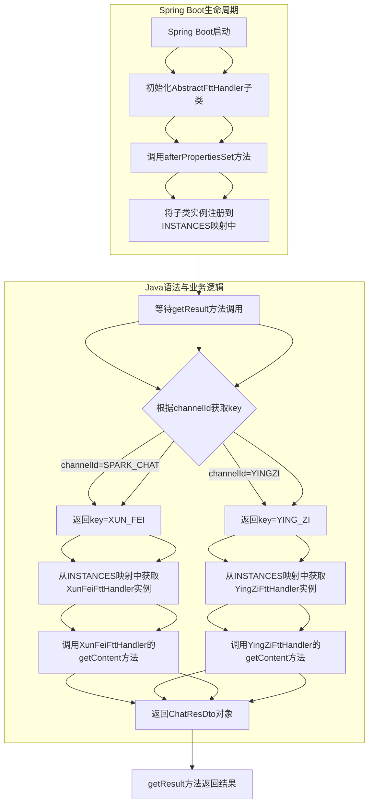

# 1、在spring-boot项目中，主程序为什么没有设置任何内容，在其他的java文件中 建一个rest接口就能够响应
在Spring Boot项目中，主程序（即入口类）通常不需要显式设置任何内容，因为Spring Boot的自动配置机制已经为我们处理了大部分默认配置。以下是原因和机制的解释：

### 1. **Spring Boot的自动配置**
Spring Boot通过`@SpringBootApplication`注解启用了自动配置功能。这个注解实际上是一个组合注解，包含了以下三个核心注解：
- `@SpringBootConfiguration`：标记该类为Spring Boot的配置类。
- `@EnableAutoConfiguration`：启用Spring Boot的自动配置机制。
- `@ComponentScan`：扫描当前包及其子包中的组件（如`@Controller`、`@Service`、`@Repository`等）。

### 2. **自动配置的作用**
- **内嵌服务器**：Spring Boot默认内嵌了Tomcat服务器，因此不需要手动配置Web服务器。
- **默认配置**：Spring Boot会根据项目的依赖自动配置相关的Bean。例如，如果项目中引入了`spring-boot-starter-web`依赖，Spring Boot会自动配置Spring MVC相关的组件。
- **组件扫描**：通过`@ComponentScan`，Spring Boot会自动扫描并注册带有`@Controller`、`@Service`、`@Repository`等注解的类。

### 3. **REST接口的响应**
在其他Java文件中创建REST接口时，只需要使用`@RestController`注解标记类，并使用`@GetMapping`、`@PostMapping`等注解定义路由即可。例如：
```java:src/main/java/com/example/demo/MyController.java
import org.springframework.web.bind.annotation.GetMapping;
import org.springframework.web.bind.annotation.RestController;

@RestController
public class MyController {
    @GetMapping("/hello")
    public String hello() {
        return "Hello, World!";
    }
}
```
Spring Boot会自动扫描并注册这个控制器，当访问`/hello`路径时，就会返回`"Hello, World!"`。

### 4. **总结**
主程序不需要显式设置任何内容，是因为Spring Boot的自动配置机制已经为我们处理了大部分默认配置。通过`@SpringBootApplication`注解，Spring Boot会自动配置内嵌服务器、扫描组件并注册控制器，从而使得在其他Java文件中创建的REST接口能够正常响应。

如果你有其他问题，欢迎随时提问！


# 2、@RestController 与 @Controller之间有啥区别？

`@RestController` 和 `@Controller` 是Spring MVC中用于定义控制器的两个注解，它们的主要区别如下：

### 1. **`@Controller`**
- **用途**：用于标记一个类作为Spring MVC的控制器。
- **返回值**：通常返回一个视图名称（View Name），Spring MVC会根据视图名称解析并渲染对应的视图（如JSP、Thymeleaf等）。
- **示例**：
  ```java
  @Controller
  public class MyController {
      @GetMapping("/hello")
      public String hello() {
          return "hello"; // 返回视图名称
      }
  }
  ```

### 2. **`@RestController`**
- **用途**：是`@Controller`和`@ResponseBody`的组合注解，用于标记一个类作为RESTful Web服务的控制器。
- **返回值**：直接返回数据（如JSON、XML等），而不是视图名称。Spring会自动将返回值序列化为JSON或XML格式。
- **示例**：
  ```java
  @RestController
  public class MyRestController {
      @GetMapping("/hello")
      public String hello() {
          return "Hello, World!"; // 直接返回数据
      }
  }
  ```

### 3. **主要区别**
| 特性                | `@Controller`                     | `@RestController`                |
|---------------------|------------------------------------|-----------------------------------|
| **返回类型**         | 视图名称（View Name）              | 数据（如JSON、XML）               |
| **适用场景**         | 传统的MVC应用，返回HTML页面        | RESTful Web服务，返回JSON/XML数据|
| **是否需要`@ResponseBody`** | 需要显式添加`@ResponseBody`注解 | 不需要，已包含`@ResponseBody`功能 |

### 4. **总结**
- 如果你需要返回视图（如HTML页面），使用`@Controller`。
- 如果你需要构建RESTful API并返回数据（如JSON），使用`@RestController`。

希望这个解释能帮助你理解两者的区别！如果有其他问题，欢迎随时提问。


# 3、EnableFeignClients、EnableApolloConfig，详细讲讲，目前还不是很明白

`@EnableFeignClients` 和 `@EnableApolloConfig` 是Spring Boot中常用的注解，分别用于启用Feign客户端和Apollo配置中心。以下是它们的详细解释：

### 1. **`@EnableFeignClients`**
- **作用**：启用Feign客户端，用于声明式HTTP调用。Feign是一个声明式的Web服务客户端，使得编写Web服务客户端变得更加简单。
- **常用属性**：
  - `basePackages`：指定Feign客户端接口所在的包路径，Spring Boot会自动扫描这些包中的接口并创建代理对象。
  - `defaultConfiguration`：指定默认的Feign配置类。
- **示例**：
  ```java
  @EnableFeignClients(basePackages = "com.example.feign")
  public class MyApplication {
      public static void main(String[] args) {
          SpringApplication.run(MyApplication.class, args);
      }
  }
  ```

### 2. **`@EnableApolloConfig`**
- **作用**：启用Apollo配置中心，用于集中管理应用的配置。Apollo是携程开源的一个分布式配置中心，支持配置的实时更新和管理。
- **常用属性**：
  - `value`：指定配置的命名空间，多个命名空间可以用逗号分隔。
  - `order`：指定配置的加载顺序。
- **示例**：
  ```java
  @EnableApolloConfig(value = "application", order = 10)
  public class MyApplication {
      public static void main(String[] args) {
          SpringApplication.run(MyApplication.class, args);
      }
  }
  ```

### 总结
`@EnableFeignClients` 用于启用Feign客户端，简化HTTP调用；`@EnableApolloConfig` 用于启用Apollo配置中心，集中管理应用配置。这两个注解在微服务架构中非常常用，能够显著提升开发效率和系统的可维护性。

## 3.1、也就是说EnableFeignClients，可以不要，但是加上了这个，书写httpp接口更加方便一点，是这一个意思嘛？
是的，您的理解是正确的。`@EnableFeignClients` 注解的作用是启用Feign客户端，它并不是必须的，但加上它可以让编写HTTP接口变得更加方便。具体来说：

1. **Feign的作用**：
  - Feign是一个声明式的HTTP客户端，它允许您通过定义接口的方式来调用HTTP服务，而不需要手动编写HTTP请求代码。
  - 通过Feign，您可以将HTTP请求的细节（如URL、请求方法、参数等）抽象到接口中，从而简化代码。

2. **不加`@EnableFeignClients`的情况**：
  - 如果不使用Feign，您可能需要手动使用`RestTemplate`或其他HTTP客户端库来发送HTTP请求，这会增加代码的复杂性和维护成本。

3. **加上`@EnableFeignClients`的好处**：
  - 代码更简洁：通过定义接口，您可以直接调用方法，而不需要关心HTTP请求的细节。
  - 可读性更高：接口的定义清晰地展示了HTTP请求的结构，便于理解和维护。
  - 易于扩展：如果需要修改HTTP请求的逻辑，只需修改接口定义，而不需要修改调用方的代码。

总结来说，`@EnableFeignClients` 不是必须的，但加上它可以显著提升代码的简洁性和可维护性，尤其是在需要频繁调用HTTP服务的场景中。

# 4、对于Apollo的使用，使用@Value注解或Environment对象获取Apollo配置中心的配置值，具体使用方法是怎么样的

在Spring Boot项目中，可以通过`@Value`注解或`Environment`对象获取Apollo配置中心的配置值。以下是具体的使用方法：

1. **使用`@Value`注解**：
  - 直接在字段上使用`@Value`注解，并指定配置项的key
  - 示例：
```java
@Value("${app.name}")
private String appName;
```
- 如果配置项不存在，可以设置默认值：
```java
@Value("${app.name:defaultName}")
private String appName;
```

2. **使用`Environment`对象**：
  - 通过`Environment`对象的`getProperty`方法获取配置值
  - 示例：
```java
@Autowired
private Environment env;

public void someMethod() {
    String appName = env.getProperty("app.name");
}
```
- 也可以设置默认值：
```java
String appName = env.getProperty("app.name", "defaultName");
```

3. **动态更新**：
  - Apollo支持配置的动态更新，无需重启应用
  - 使用`@ApolloConfigChangeListener`注解监听配置变化
  - 示例：
```java
@ApolloConfigChangeListener
private void onChange(ConfigChangeEvent changeEvent) {
    if (changeEvent.isChanged("app.name")) {
        // 处理配置变化
    }
}
```

4. **注意事项**：
  - 确保配置项的key与Apollo中的配置一致
  - 对于敏感配置，建议使用加密存储
  - 在生产环境中，建议为关键配置设置默认值，避免配置缺失导致应用启动失败

如果您有具体的配置项或使用场景，我可以提供更详细的帮助。

# 5、DTO和VO，与interface的区别


DTO（Data Transfer Object）和VO（View Object）与接口（interface）有本质区别，具体如下：

1. **DTO和VO的作用**：
  - DTO用于在不同层之间传输数据，通常包含一组字段，用于封装数据。
  - VO用于封装返回给前端的数据，通常包含多个DTO或实体的组合。
  - 它们都是**数据对象**，而不是接口。

2. **与接口的区别**：
  - **接口（interface）**：定义了一组方法签名，用于规范类的行为，不包含具体实现。
  - **DTO和VO**：是具体的类，包含字段和getter/setter方法，用于存储和传输数据。

3. **实现方式**：
  - DTO和VO通常是**普通Java类**，包含字段、构造方法、getter/setter方法等。
  - 示例：
    ```java
    public class UserDTO {
        private String name;
        private int age;
        // getter/setter方法
    }
    ```

4. **使用场景**：
  - DTO和VO用于**数据封装和传输**，而不是定义行为规范。
  - 接口用于**定义行为规范**，由具体类实现。

总结：DTO和VO是数据对象，用于封装和传输数据，而接口是行为规范，用于定义方法签名。两者用途不同，不能混淆。
        
# 6、DTO和VO的区别
DTO（Data Transfer Object）和VO（View Object）是两种常用的数据传输对象，它们在软件开发中有不同的用途和含义。以下是它们之间的主要区别：
### 1. **定义**
- **DTO（Data Transfer Object）**：数据传输对象，主要用于在不同层之间传输数据。DTO通常用于服务层和控制器层之间的数据传递，目的是减少网络请求次数和提高性能。
- **VO（View Object）**：视图对象，主要用于封装返回给前端的数据。VO通常用于控制器层和视图层之间的数据传递，目的是将数据转换为适合前端展示的格式。

### 2. **用途**
- **DTO**：用于封装从数据库或服务层获取的数据，通常包含多个字段和复杂的对象关系。DTO可以包含业务逻辑，但主要关注数据的传输。
- **VO**：用于封装返回给前端的数据，通常包含简单的字段和格式化后的数据。VO通常不包含业务逻辑，主要关注数据的展示。

### 3. **结构**
- **DTO**：通常包含多个字段和复杂的对象关系，可能会有嵌套的DTO或集合类型的字段。
- **VO**：通常包含简单的字段，可能会有一些格式化的方法，用于将数据转换为适合前端展示的格式。
- **示例**：
  ```java
  // DTO示例
  public class UserDTO {
      private String name;
      private int age;
      private AddressDTO address; // 嵌套DTO
      // getter/setter方法
  }

  // VO示例
  public class UserVO {
      private String name;
      private String formattedAge; // 格式化后的字段
      // getter/setter方法
  }
  ```
### 4. **转换**
- **DTO到VO的转换**：通常需要在控制器层或服务层进行转换，将DTO转换为VO，以便返回给前端。
- **VO到DTO的转换**：通常不需要，因为VO主要用于展示，不涉及业务逻辑。
- **转换工具**：可以使用MapStruct、ModelMapper等工具来简化DTO和VO之间的转换。
- **示例**：
  ```java
  // DTO到VO的转换示例
  public UserVO convertToVO(UserDTO userDTO) {
      UserVO userVO = new UserVO();
      userVO.setName(userDTO.getName());
      userVO.setFormattedAge(formatAge(userDTO.getAge()));
      return userVO;
  }
  ```
### 5. **总结**
- **DTO**：用于在不同层之间传输数据，通常包含多个字段和复杂的对象关系，可能会有业务逻辑。
- **VO**：用于封装返回给前端的数据，通常包含简单的字段和格式化后的数据，不包含业务逻辑。
- 两者的主要区别在于用途和结构，DTO关注数据传输，VO关注数据展示。
- 在实际开发中，DTO和VO的使用可以提高代码的可读性和可维护性，建议根据具体需求进行选择和使用。
- 如果您有其他问题或需要更详细的解释，请随时提问！

# 7、好的，列举下dependencies，依赖项的所有方式


在Gradle中，常见的依赖配置方式有以下几种：

1. **`implementation`**：
  - 表示依赖在编译时和运行时都需要，并且会打包到最终的JAR文件中。
  - 适用于项目实际运行所需的依赖，如Spring Boot的核心库。

2. **`compileOnly`**：
  - 表示依赖仅在编译时使用，不会打包到最终的JAR文件中。
  - 适用于像Lombok这样的工具，它们在编译时生成代码，但运行时不需要。

3. **`annotationProcessor`**：
  - 表示依赖是注解处理器，用于在编译时处理注解并生成代码。
  - 通常与`compileOnly`一起使用，确保注解处理器仅在编译时运行。

4. **`runtimeOnly`**：
  - 表示依赖仅在运行时需要，不会在编译时使用。
  - 适用于像数据库驱动这样的依赖，它们在编译时不需要，但在运行时需要。

5. **`testImplementation`**：
  - 表示依赖仅在测试时使用，不会打包到最终的JAR文件中。
  - 适用于单元测试或集成测试所需的依赖，如JUnit或Mockito。

6. **`testCompileOnly`**：
  - 表示依赖仅在测试编译时使用，不会打包到最终的JAR文件中。
  - 适用于测试时需要的工具，但运行时不需要。

7. **`testRuntimeOnly`**：
  - 表示依赖仅在测试运行时需要，不会在测试编译时使用。
  - 适用于测试时需要的运行时依赖，如特定的测试框架扩展。

总结：这些依赖配置方式可以根据项目的具体需求选择使用，确保依赖在正确的作用域内生效。
        
# 8、@Data是什么意思呢？
## 8.1、@Data的作用
`@Data` 是 Lombok 库中的一个注解，用于自动生成 Java 类的常用方法。使用 `@Data` 注解可以减少样板代码，提高代码的可读性和可维护性。以下是 `@Data` 注解的主要功能：
- **生成 Getter 和 Setter 方法**：为类的所有字段自动生成对应的 getter 和 setter 方法。
- **生成 toString 方法**：自动生成 `toString()` 方法，方便打印对象的字符串表示。
- **生成 equals 和 hashCode 方法**：自动生成 `equals()` 和 `hashCode()` 方法，方便对象的比较和哈希表存储。
- **生成无参构造函数**：自动生成一个无参构造函数。
- **生成全参构造函数**：自动生成一个包含所有字段的全参构造函数（如果使用了 `@AllArgsConstructor` 注解）。
- **生成 `@NonNull` 注解**：可以在字段上使用 `@NonNull` 注解，自动生成非空检查的代码。
- **生成 `@Builder` 注解**：可以与 `@Builder` 注解结合使用，支持构建器模式的创建。
- **生成 `@Accessors` 注解**：可以自定义生成的 getter 和 setter 方法的命名风格。
- **生成 `@Value` 注解**：可以与 `@Value` 注解结合使用，支持不可变对象的创建。
- **生成 `@With` 注解**：可以与 `@With` 注解结合使用，支持方法链式调用的创建。
等等，还有很多其他的生成方法和功能。

## 8.2、使用方法，通俗讲法

`@Data`是Lombok库中的一个注解，用于自动生成常见的Java方法，包括`getter`、`setter`、`toString`、`equals`和`hashCode`等。它的作用是简化代码，避免手动编写这些方法。

### 工作原理：
1. **自动生成方法**：`@Data`会自动为类中的所有字段生成`getter`和`setter`方法，以及`toString`、`equals`和`hashCode`方法。
2. **简化代码**：通过使用`@Data`，开发者无需手动编写这些方法，减少了代码量，提高了开发效率。

### 示例：
```java 
@Data
public class ChatReqDto {
    private Boolean stream;
    private String message;
    private String args;
}
```

### 解释：
1. `@Data`会自动为`stream`、`message`和`args`字段生成`getter`和`setter`方法。
2. 同时，`@Data`还会生成`toString`、`equals`和`hashCode`方法，方便对象的打印、比较和哈希计算。

总结：`@Data`通过自动生成常见的方法，简化了代码编写，特别适用于POJO（Plain Old Java Object）类。
        
 ### 8.2.1、如果不适用@Data注解，手动编写getter和setter方法


如果没有`@Data`注解，`ChatReqDto`类需要手动编写`getter`、`setter`、`toString`、`equals`和`hashCode`方法。以下是完整的代码示例：

```java:d:\gitlab\yingzi-appservice-bfv\yingzi-appservice-bfv-provider\src\main\java\com\yingzi\appservice\bfv\vo\req\ChatReqDto.java
public class ChatReqDto {
    private Boolean stream;
    private String message;
    private String args;

    public Boolean getStream() {
        return stream;
    }

    public void setStream(Boolean stream) {
        this.stream = stream;
    }

    public String getMessage() {
        return message;
    }

    public void setMessage(String message) {
        this.message = message;
    }

    public String getArgs() {
        return args;
    }

    public void setArgs(String args) {
        this.args = args;
    }

    @Override
    public String toString() {
        return "ChatReqDto{" +
                "stream=" + stream +
                ", message='" + message + '\'' +
                ", args='" + args + '\'' +
                '}';
    }

    @Override
    public boolean equals(Object o) {
        if (this == o) return true;
        if (o == null || getClass() != o.getClass()) return false;
        ChatReqDto that = (ChatReqDto) o;
        return Objects.equals(stream, that.stream) &&
                Objects.equals(message, that.message) &&
                Objects.equals(args, that.args);
    }

    @Override
    public int hashCode() {
        return Objects.hash(stream, message, args);
    }
}
```

### 解释：
1. **getter和setter方法**：为每个字段生成`getter`和`setter`方法，用于访问和修改字段值。
2. **toString方法**：生成`toString`方法，用于打印对象的字段值。
3. **equals方法**：生成`equals`方法，用于比较两个对象是否相等。
4. **hashCode方法**：生成`hashCode`方法，用于计算对象的哈希值。

总结：没有`@Data`注解时，需要手动编写这些方法，代码量会增加，但逻辑与`@Data`生成的方法相同。

# 9、解释下Map<String, Object> response = new HashMap<>();
Map<String, Object> response = new HashMap<>(); 是Java中创建一个HashMap对象的语句。以下是对这行代码的详细解释：
### 1. **Map接口**
- `Map`是Java集合框架中的一个接口，用于存储键值对（key-value pairs）。它允许通过键来快速访问对应的值。
- `Map`接口的常见实现类包括`HashMap`、`TreeMap`和`LinkedHashMap`等。
- `Map`接口提供了一些常用的方法，如`put()`、`get()`、`remove()`等，用于操作键值对。
- `Map`接口的特点是：
  - 键是唯一的，不能重复。
  - 值可以重复，可以为`null`。
  - 键值对的顺序不一定保持插入顺序（在`HashMap`中）。
  - 支持快速查找、插入和删除操作。
  - 可以使用泛型来指定键和值的类型。
  - 支持遍历键、值和键值对。
  - 支持线程安全的实现（如`ConcurrentHashMap`）。
  - 支持流式操作（Java 8及以上版本）。
  - 支持集合视图（如`keySet()`、`values()`和`entrySet()`）。
  - 支持自定义对象作为键（需要重写`equals()`和`hashCode()`方法）。
  - 支持嵌套Map（Map中可以存储另一个Map）。
  - 支持默认值（如`getOrDefault()`方法）。
  - 支持不可变Map（如`Collections.unmodifiableMap()`方法）。
  - 支持排序Map（如`TreeMap`）。
  - 支持并发Map（如`ConcurrentHashMap`）。
  - 支持线程安全的Map（如`Collections.synchronizedMap()`方法）。
  - 支持自定义比较器（如`TreeMap`）。
  - 支持自定义序列化（如`Serializable`接口）。
  - 支持自定义反序列化（如`readObject()`和`writeObject()`方法）。
  - 支持自定义克隆（如`clone()`方法）。
  - 支持自定义迭代器（如`Iterator`接口）。
  - 支持自定义流式操作（如`Stream`接口）。
  - 支持自定义函数式编程（如`Function`接口）。
  - 支持自定义Lambda表达式（如`Consumer`接口）。
  - 支持自定义方法引用（如`MethodReference`）。
  - 支持自定义异常处理（如`try-catch`语句）。
  - 支持自定义日志记录（如`Logger`接口）。
  - 等等其他特点

### 9.2、例子详细解释
`Map<String, Object> response = new HashMap<>();` 这行代码的详细解释如下：

1. **`Map<String, Object>`**：
  - `Map` 是Java中的一个接口，表示键值对的集合。
  - `<String, Object>` 是泛型声明，表示键的类型是`String`，值的类型是`Object`，任何类都是Object的子类

2. **`response`**：
  - 这是变量的名称，用于存储`Map`的实例。

3. **`new HashMap<>()`**：
  - `HashMap` 是`Map`接口的一个实现类，提供了基于哈希表的键值对存储。
  - `<>` 是Java 7引入的钻石操作符，用于自动推断泛型类型。

4. **整体含义**：
  - 这行代码创建了一个`HashMap`实例，并将其赋值给`response`变量。
  - `response`可以存储键为`String`类型、值为`Object`类型的键值对。

5. **示例**：
```java
Map<String, Object> response = new HashMap<>();
response.put("id", 1);
response.put("content", "Hello, World!");
```

在这个示例中，`response`存储了两个键值对，键分别为`"id"`和`"content"`，值分别为`1`和`"Hello, World!"`。
        
# 10、final是什么关键字，用处，同级别还有哪些关键字。这个类比javascript中是什么
`final` 是Java中的一个关键字，用于声明不可变的变量、方法和类。它的主要作用是限制对变量、方法和类的修改。以下是对 `final` 关键字的详细解释：
### 1. **`final` 变量**
- **作用**：声明一个不可变的变量，一旦赋值后不能再修改。
- **示例**：
```java
final int MAX_VALUE = 100;
```
在这个示例中，`MAX_VALUE` 是一个常量，一旦赋值为 `100`，就不能再修改它的值。
### 2. **`final` 方法**
- **作用**：声明一个不可重写的方法，子类不能重写这个方法。
- **示例**：
```java
public final void display() {
    System.out.println("This is a final method.");
}
```
在这个示例中，`display()` 方法是一个 `final` 方法，子类不能重写它。
### 3. **`final` 类**
- **作用**：声明一个不可继承的类，其他类不能继承这个类。
- **示例**：
```java
public final class Constants {
    public static final int MAX_VALUE = 100;
}
```
在这个示例中，`Constants` 是一个 `final` 类，其他类不能继承它。
### 4. **同级别的关键字**
- **`static`**：用于声明静态变量、静态方法和静态块，表示与类相关联，而不是与实例相关联。
- **`abstract`**：用于声明抽象类和抽象方法，表示类不能被实例化，方法没有具体实现。
- **`synchronized`**：用于声明同步方法或同步块，表示在多线程环境中对方法或代码块进行同步控制。
- **`volatile`**：用于声明易变变量，表示变量可能会被多个线程修改，确保每次读取都是最新的值。
- **`transient`**：用于声明瞬态变量，表示该变量不需要序列化，通常用于防止敏感数据被序列化。
- **`native`**：用于声明本地方法，表示该方法是用其他语言（如C或C++）实现的。
- **`strictfp`**：用于声明严格浮点计算，确保浮点计算的结果在不同平台上是一致的。

### 5. **JavaScript中的类比**
在JavaScript中，没有直接对应的 `final` 关键字，但可以使用以下方式实现类似的效果：
- **`const`**：用于声明不可变的变量，类似于 Java 中的 `final` 变量。
- **`Object.freeze()`**：用于冻结对象，防止对象的属性被修改，类似于 Java 中的 `final` 类。
- **`Object.defineProperty()`**：用于定义不可重写的方法，类似于 Java 中的 `final` 方法。
- **`class`**：用于声明类，JavaScript 中的类可以被继承，但可以使用 `extends` 关键字来限制继承。
- **`static`**：用于声明静态方法和属性，类似于 Java 中的 `static` 关键字。
- **`async`**：用于声明异步函数，类似于 Java 中的 `synchronized` 关键字。
- **`let` 和 `var`**：用于声明变量，`let` 声明的变量是块级作用域，类似于 Java 中的 `final` 变量，而 `var` 声明的变量是函数级作用域。
- **`function`**：用于声明函数，JavaScript 中的函数可以是匿名函数或命名函数，类似于 Java 中的方法。
- **`this`**：用于引用当前对象，类似于 Java 中的 `this` 关键字。
- **`prototype`**：用于实现继承和共享方法，类似于 Java 中的类和对象。
- **`new`**：用于创建对象实例，类似于 Java 中的 `new` 关键字。
- **`delete`**：用于删除对象的属性，类似于 Java 中的 `transient` 关键字。
- **`typeof`**：用于获取变量的类型，类似于 Java 中的 `instanceof` 关键字。
- **`instanceof`**：用于判断对象是否是某个类的实例，类似于 Java 中的 `instanceof` 关键字。
- **`class`**：用于声明类，JavaScript 中的类可以被继承，但可以使用 `extends` 关键字来限制继承。
- **`async`**：用于声明异步函数，类似于 Java 中的 `synchronized` 关键字。
- **`await`**：用于等待异步操作的结果，类似于 Java 中的 `synchronized` 关键字。
- **`Promise`**：用于处理异步操作的结果，类似于 Java 中的 `Future` 接口。
- **`try-catch`**：用于异常处理，类似于 Java 中的 `try-catch` 语句。
- **`throw`**：用于抛出异常，类似于 Java 中的 `throw` 语句。
- **`finally`**：用于执行最终的清理操作，类似于 Java 中的 `finally` 语句。
- **`async/await`**：用于处理异步操作，类似于 Java 中的 `CompletableFuture`。
- **`Promise.all()`**：用于并行处理多个异步操作，类似于 Java 中的 `CompletableFuture.allOf()`。

# 11、implements是什么关键字
`implements` 是Java中的一个关键字，用于实现接口。它的主要作用是让一个类实现一个或多个接口，从而继承接口中定义的方法。以下是对 `implements` 关键字的详细解释：
### 1. **定义**
- `implements` 关键字用于声明一个类实现一个或多个接口。
- 接口是一种特殊的引用类型，类似于类，但只能包含常量、方法签名和嵌套类型，不能包含实例变量和方法实现。
- 接口用于定义类的行为规范，类通过实现接口来提供具体的实现。
- 接口可以包含默认方法和静态方法，但不能包含实例方法的实现。
- 接口可以继承其他接口，但不能实现其他接口。
- 接口可以包含常量，但不能包含实例变量。
- 接口可以包含嵌套类型，但不能包含实例类型。
- 接口可以包含注解，但不能包含实例注解。
- 接口可以包含泛型，但不能包含实例泛型。
- 接口可以包含方法重载，但不能包含实例方法重载。
- 接口可以包含方法重写，但不能包含实例方法重写。


### 2. **语法**
```java
class ClassName implements InterfaceName {
    // 实现接口中的方法
}
```
### 3. **示例**
```java
public interface Animal {
    void eat();
    void sleep();
}
public class Dog implements Animal {
    @Override
    public void eat() {
        System.out.println("Dog is eating.");
    }

    @Override
    public void sleep() {
        System.out.println("Dog is sleeping.");
    }
}
```
在这个示例中，`Dog` 类实现了 `Animal` 接口，并提供了 `eat()` 和 `sleep()` 方法的具体实现。
### 4. **实现多个接口**
- 一个类可以实现多个接口，使用逗号分隔接口名称。
```java
public interface Swimmer {
    void swim();
}
public class Dolphin implements Animal, Swimmer {
    @Override
    public void eat() {
        System.out.println("Dolphin is eating.");
    }

    @Override
    public void sleep() {
        System.out.println("Dolphin is sleeping.");
    }

    @Override
    public void swim() {
        System.out.println("Dolphin is swimming.");
    }
}
```
在这个示例中，`Dolphin` 类实现了 `Animal` 和 `Swimmer` 接口，并提供了所有方法的具体实现。
### 5. **接口的多态性**
- 接口可以用于实现多态性，允许使用接口类型的引用来指向实现该接口的对象。
```java
Animal dog = new Dog();
Animal dolphin = new Dolphin();
dog.eat(); // 输出：Dog is eating.
dolphin.eat(); // 输出：Dolphin is eating.
```
### 6. **总结**
- `implements` 关键字用于实现接口，使类能够继承接口中定义的方法。
- 一个类可以实现多个接口，从而实现多态性和代码复用。
- 接口用于定义类的行为规范，类通过实现接口来提供具体的实现。
- 接口可以包含默认方法和静态方法，但不能包含实例方法的实现。
- 见1中定义

# 12、apollo的注解@Value怎么使用
`@Value` 注解用于从 Apollo 配置中心获取配置值。它可以用于字段、方法参数和方法返回值等位置。以下是 `@Value` 注解的使用方法：
### 1. **在字段上使用**
- 直接在字段上使用 `@Value` 注解，并指定配置项的 key。
- 示例：
```java
@Value("${app.name}")
private String appName;
```
- 在这个示例中，`appName` 字段将从 Apollo 配置中心获取 `app.name` 的值。
- 如果配置项不存在，可以设置默认值：
```java
@Value("${app.name:defaultName}")
private String appName;
```
- 在这个示例中，如果 `app.name` 不存在，则 `appName` 的值将为 `defaultName`。
- 如果配置项是一个列表，可以使用逗号分隔的字符串：
```java
@Value("${app.servers:localhost:8080,localhost:8081}")
private List<String> servers;
```
- 在这个示例中，`servers` 字段将从 Apollo 配置中心获取 `app.servers` 的值，并将其转换为一个列表。
- 如果配置项是一个数组，可以使用逗号分隔的字符串：
```java
@Value("${app.servers:localhost:8080,localhost:8081}")
private String[] servers;
```
- 在这个示例中，`servers` 字段将从 Apollo 配置中心获取 `app.servers` 的值，并将其转换为一个数组。
- 如果配置项是一个 Map，可以使用逗号分隔的字符串：
```java
@Value("#{${app.servers:{localhost:8080,localhost:8081}}}")
private Map<String, String> servers;
```
- 在这个示例中，`servers` 字段将从 Apollo 配置中心获取 `app.servers` 的值，并将其转换为一个 Map。
- 如果配置项是一个对象，可以使用 `@ConfigurationProperties` 注解：
```java
@ConfigurationProperties(prefix = "app")
public class AppProperties {
    private String name;
    private List<String> servers;
    // getter/setter方法
}
```
- 在这个示例中，`AppProperties` 类将从 Apollo 配置中心获取以 `app` 为前缀的配置项，并将其转换为一个对象。
- 如果配置项是一个嵌套对象，可以使用 `@ConfigurationProperties` 注解：
```java
@ConfigurationProperties(prefix = "app")
public class AppProperties {
    private String name;
    private List<ServerProperties> servers;
    // getter/setter方法
}
public class ServerProperties {
    private String host;
    private int port;
    // getter/setter方法
}
```
- 在这个示例中，`AppProperties` 类将从 Apollo 配置中心获取以 `app` 为前缀的配置项，并将其转换为一个嵌套对象。
- 如果配置项是一个集合，可以使用 `@ConfigurationProperties` 注解：
```java
@ConfigurationProperties(prefix = "app")
public class AppProperties {
    private String name;
    private List<String> servers;
    // getter/setter方法
}
```
- 在这个示例中，`AppProperties` 类将从 Apollo 配置中心获取以 `app` 为前缀的配置项，并将其转换为一个集合。

### 2. **在方法参数上使用**
- 可以在方法参数上使用 `@Value` 注解，并指定配置项的 key。
- 示例：
```java
public void setAppName(@Value("${app.name}") String appName) {
    this.appName = appName;
}
```
- 在这个示例中，`setAppName` 方法的参数 `appName` 将从 Apollo 配置中心获取 `app.name` 的值。 
- 如果配置项不存在，可以设置默认值：
```java
public void setAppName(@Value("${app.name:defaultName}") String appName) {
    this.appName = appName;
}
```
- 在这个示例中，如果 `app.name` 不存在，则 `appName` 的值将为 `defaultName`。
- 如果配置项是一个列表，可以使用逗号分隔的字符串：
```java
public void setServers(@Value("${app.servers:localhost:8080,localhost:8081}") List<String> servers) {
    this.servers = servers;
}
```
- 在这个示例中，`servers` 参数将从 Apollo 配置中心获取 `app.servers` 的值，并将其转换为一个列表。
- 如果配置项是一个数组，可以使用逗号分隔的字符串：
```java
public void setServers(@Value("${app.servers:localhost:8080,localhost:8081}") String[] servers) {
    this.servers = servers;
}
```
- 在这个示例中，`servers` 参数将从 Apollo 配置中心获取 `app.servers` 的值，并将其转换为一个数组。
- 如果配置项是一个 Map，可以使用逗号分隔的字符串：
```java
public void setServers(@Value("#{${app.servers:{localhost:8080,localhost:8081}}}") Map<String, String> servers) {
    this.servers = servers;
}
```
- 在这个示例中，`servers` 参数将从 Apollo 配置中心获取 `app.servers` 的值，并将其转换为一个 Map。
- 如果配置项是一个对象，可以使用 `@ConfigurationProperties` 注解：
```java
@ConfigurationProperties(prefix = "app")
public class AppProperties {
    private String name;
    private List<String> servers;
    // getter/setter方法
}
```
- 在这个示例中，`AppProperties` 类将从 Apollo 配置中心获取以 `app` 为前缀的配置项，并将其转换为一个对象。
- 如果配置项是一个嵌套对象，可以使用 `@ConfigurationProperties` 注解：
```java
@ConfigurationProperties(prefix = "app")
public class AppProperties {
    private String name;
    private List<ServerProperties> servers;
    // getter/setter方法
}
public class ServerProperties {
    private String host;
    private int port;
    // getter/setter方法
}
```
- 在这个示例中，`AppProperties` 类将从 Apollo 配置中心获取以 `app` 为前缀的配置项，并将其转换为一个嵌套对象。
- 如果配置项是一个集合，可以使用 `@ConfigurationProperties` 注解：
```java
@ConfigurationProperties(prefix = "app")
public class AppProperties {
    private String name;
    private List<String> servers;
    // getter/setter方法
}
```
- 在这个示例中，`AppProperties` 类将从 Apollo 配置中心获取以 `app` 为前缀的配置项，并将其转换为一个集合。
- 如果配置项是一个集合，可以使用 `@ConfigurationProperties` 注解：
```java
@ConfigurationProperties(prefix = "app")
public class AppProperties {
    private String name;
    private List<String> servers;
    // getter/setter方法
}
```
- 在这个示例中，`AppProperties` 类将从 Apollo 配置中心获取以 `app` 为前缀的配置项，并将其转换为一个集合。

### 3. **在方法返回值上使用**
- 可以在方法返回值上使用 `@Value` 注解，并指定配置项的 key。
- 示例：
```java
@Value("${app.name}")
public String getAppName() {
    return appName;
}
```
- 在这个示例中，`getAppName` 方法将从 Apollo 配置中心获取 `app.name` 的值，并返回它。
- 如果配置项不存在，可以设置默认值：
```java
@Value("${app.name:defaultName}")
public String getAppName() {
    return appName;
}
```
- 在这个示例中，如果 `app.name` 不存在，则 `getAppName` 方法将返回 `defaultName`。
- 如果配置项是一个列表，可以使用逗号分隔的字符串：
```java
@Value("${app.servers:localhost:8080,localhost:8081}")
public List<String> getServers() {
    return servers;
}
```
- 在这个示例中，`getServers` 方法将从 Apollo 配置中心获取 `app.servers` 的值，并将其转换为一个列表。
- 如果配置项是一个数组，可以使用逗号分隔的字符串：
```java
@Value("${app.servers:localhost:8080,localhost:8081}")
public String[] getServers() {
    return servers;
}
```
- 在这个示例中，`getServers` 方法将从 Apollo 配置中心获取 `app.servers` 的值，并将其转换为一个数组。
- 如果配置项是一个 Map，可以使用逗号分隔的字符串：
```java
@Value("#{${app.servers:{localhost:8080,localhost:8081}}}")
public Map<String, String> getServers() {
    return servers;
}
```
- 在这个示例中，`getServers` 方法将从 Apollo 配置中心获取 `app.servers` 的值，并将其转换为一个 Map。
- 如果配置项是一个对象，可以使用 `@ConfigurationProperties` 注解：
```java
@ConfigurationProperties(prefix = "app")
public class AppProperties {
    private String name;
    private List<String> servers;
    // getter/setter方法
}
```
- 在这个示例中，`AppProperties` 类将从 Apollo 配置中心获取以 `app` 为前缀的配置项，并将其转换为一个对象。
- 如果配置项是一个嵌套对象，可以使用 `@ConfigurationProperties` 注解：
```java
@ConfigurationProperties(prefix = "app")
public class AppProperties {
    private String name;
    private List<ServerProperties> servers;
    // getter/setter方法
} 
public class ServerProperties {
    private String host;
    private int port;
    // getter/setter方法
}
```
- 在这个示例中，`AppProperties` 类将从 Apollo 配置中心获取以 `app` 为前缀的配置项，并将其转换为一个嵌套对象。
- 如果配置项是一个集合，可以使用 `@ConfigurationProperties` 注解：
```java
@ConfigurationProperties(prefix = "app")
public class AppProperties {
    private String name;
    private List<String> servers;
    // getter/setter方法
}
```
- 在这个示例中，`AppProperties` 类将从 Apollo 配置中心获取以 `app` 为前缀的配置项，并将其转换为一个集合。


### 4. **总结**
- `@Value` 注解用于从 Apollo 配置中心获取配置值，可以用于字段、方法参数和方法返回值等位置。
- 可以设置默认值、列表、数组、Map 和对象等类型的配置项。
- 可以使用 `@ConfigurationProperties` 注解来获取以特定前缀的配置项，并将其转换为对象或集合。
- 可以使用 `@Value` 注解来获取嵌套对象的配置项，并将其转换为嵌套对象。
- 可以使用 `@Value` 注解来获取集合类型的配置项，并将其转换为集合。
- 可以使用 `@Value` 注解来获取默认值、列表、数组、Map 和对象等类型的配置项。
- 可以使用 `@Value` 注解来获取嵌套对象的配置项，并将其转换为嵌套对象。


# 13、@ConfigurationProperties是什么注解
`@ConfigurationProperties` 是 Spring Framework 中的一个注解，用于将配置文件中的属性映射到 Java 对象。它通常用于读取外部配置（如 `application.properties` 或 `application.yml` 文件）中的属性，并将这些属性绑定到一个 POJO（Plain Old Java Object）类中。以下是对 `@ConfigurationProperties` 注解的详细解释：
### 1. **定义**
- `@ConfigurationProperties` 注解用于将配置文件中的属性映射到 Java 对象。
- 它可以用于类、方法和方法参数等位置。
- 它通常与 `@EnableConfigurationProperties` 注解结合使用，以启用配置属性的绑定。
- 它可以与 `@Value` 注解结合使用，以获取单个属性的值。
- 它可以与 `@PropertySource` 注解结合使用，以指定外部配置文件的路径。
- 它可以与 `@Component` 注解结合使用，以将配置属性类注册为 Spring Bean。
- 它可以与 `@Configuration` 注解结合使用，以将配置属性类注册为 Spring 配置类。
- 它可以与 `@Bean` 注解结合使用，以将配置属性类注册为 Spring Bean。
- 它可以与 `@Autowired` 注解结合使用，以自动注入配置属性类。
- 它可以与 `@Qualifier` 注解结合使用，以指定要注入的配置属性类。
- 它可以与 `@Primary` 注解结合使用，以指定主要的配置属性类。
- 它可以与 `@Scope` 注解结合使用，以指定配置属性类的作用域。
- 它可以与 `@Lazy` 注解结合使用，以指定配置属性类的懒加载。
- 它可以与 `@PostConstruct` 注解结合使用，以指定配置属性类的初始化方法。
- 它可以与 `@PreDestroy` 注解结合使用，以指定配置属性类的销毁方法。
- 它可以与 `@Async` 注解结合使用，以指定配置属性类的异步方法。
- 它可以与 `@Transactional` 注解结合使用，以指定配置属性类的事务方法。
- 它可以与 `@Scheduled` 注解结合使用，以指定配置属性类的定时任务。
- 它可以与 `@EventListener` 注解结合使用，以指定配置属性类的事件监听器。
- 它可以与 `@Controller` 注解结合使用，以指定配置属性类的控制器。
- 它可以与 `@Service` 注解结合使用，以指定配置属性类的服务类。
- 它可以与 `@Repository` 注解结合使用，以指定配置属性类的持久化类。
- 它可以与 `@RestController` 注解结合使用，以指定配置属性类的 REST 控制器。
- 它可以与 `@RequestMapping` 注解结合使用，以指定配置属性类的请求映射。
- 它可以与 `@RequestParam` 注解结合使用，以指定配置属性类的请求参数。
- 它可以与 `@RequestBody` 注解结合使用，以指定配置属性类的请求体。
- 它可以与 `@ResponseBody` 注解结合使用，以指定配置属性类的响应体。
- 它可以与 `@ResponseStatus` 注解结合使用，以指定配置属性类的响应状态。
- 它可以与 `@PathVariable` 注解结合使用，以指定配置属性类的路径变量。
- 它可以与 `@CookieValue` 注解结合使用，以指定配置属性类的 Cookie 值。
- 它可以与 `@SessionAttributes` 注解结合使用，以指定配置属性类的会话属性。
- 它可以与 `@ModelAttribute` 注解结合使用，以指定配置属性类的模型属性。
- 它可以与 `@InitBinder` 注解结合使用，以指定配置属性类的初始化绑定器。
- 它可以与 `@ExceptionHandler` 注解结合使用，以指定配置属性类的异常处理器。
- 它可以与 `@ControllerAdvice` 注解结合使用，以指定配置属性类的控制器建议。
- 它可以与 `@ResponseEntity` 注解结合使用，以指定配置属性类的响应实体。
- 它可以与 `@ResponseEntityExceptionHandler` 注解结合使用，以指定配置属性类的响应实体异常处理器。


### 2. **语法**
```java
@ConfigurationProperties(prefix = "app")
public class AppProperties {
    private String name;
    private String version;
    private List<String> servers;

    // getter/setter方法
}
```
### 3. **示例**
```java
@ConfigurationProperties(prefix = "app")
public class AppProperties {
    private String name;
    private String version;
    private List<String> servers;

    public String getName() {
        return name;
    }

    public void setName(String name) {
        this.name = name;
    }

    public String getVersion() {
        return version;
    }

    public void setVersion(String version) {
        this.version = version;
    }

    public List<String> getServers() {
        return servers;
    }

    public void setServers(List<String> servers) {
        this.servers = servers;
    }
}
```
# 12、 AbstractFttHandler.initThreadLocal() 是啥意思，使用场景是怎样
`AbstractFttHandler.initThreadLocal()` 是一个方法，通常用于初始化线程本地变量（ThreadLocal）。线程本地变量是每个线程独立拥有的变量，每个线程都可以访问和修改自己的副本，而不会影响其他线程的副本。以下是对 `AbstractFttHandler.initThreadLocal()` 方法的详细解释：
### 1. **定义**
- `AbstractFttHandler` 是一个抽象类，通常用于处理某种特定类型的请求或任务。
- `initThreadLocal()` 是一个方法，用于初始化线程本地变量。
- 线程本地变量通常用于存储与当前线程相关的数据，例如用户会话信息、请求上下文等。
- 线程本地变量可以避免多线程环境中的数据竞争和共享问题。
- 线程本地变量可以提高性能，因为每个线程都可以独立访问自己的副本，而不需要进行同步。
- 线程本地变量可以简化代码，因为每个线程都可以独立访问自己的副本，而不需要传递参数。
- 线程本地变量可以提高可读性、可维护性、可扩展性、可配置性、可追踪性，因为每个线程都可以独立访问自己的副本，而不需要传递参数。

### 2. **语法**
```java
protected void initThreadLocal() {
    // 初始化线程本地变量
}
```
### 3. **示例**
```java
public abstract class AbstractFttHandler {
    private ThreadLocal<String> threadLocal = new ThreadLocal<>();

    protected void initThreadLocal() {
        threadLocal.set("Initial Value");
    }

    public String getThreadLocalValue() {
        return threadLocal.get();
    }
}
```
### 4. **使用场景**
- 在多线程环境中，需要为每个线程存储独立的数据，例如用户会话信息、请求上下文等。
- 在处理请求时，需要为每个请求存储独立的数据，例如请求参数、响应结果等。
- 在执行异步任务、执行定时任务、批处理任务、流式处理任务、事件驱动任务、消息驱动任务、流式计算任务、批量计算任务时，需要为每个任务存储独立的数据，例如任务状态、执行结果等。
- 在时，需要为每个任务存储独立的数据，例如任务状态、执行结果等。

### 5、如果不使用initThreadLocal，会导致什么问题？
如果不调用`AbstractFttHandler.initThreadLocal()`，可能会导致以下问题：
1. **数据竞争**：在多线程环境下，未初始化的线程本地变量可能导致多个线程共享相同的数据，从而引发数据竞争问题。
2. **上下文信息丢失**：线程本地变量通常用于存储与当前线程相关的上下文信息（如请求来源、语言等）。如果未初始化，这些信息可能会丢失，导致后续处理逻辑无法正确执行。
3. **内存泄漏**：如果线程本地变量未正确初始化，可能会导致线程池中的线程保留旧的数据，从而引发内存泄漏问题。
因此，`initThreadLocal()`的作用是确保每个线程在处理请求时都有一个干净的本地变量环境，避免上述问题。
        

# 13、JAVA注释中的@see是什么意思?
在 Java 注释中，`@see` 是一个 Javadoc 标签，用于在文档中提供相关参考信息。它通常用于指向其他类、方法、字段或外部资源，帮助开发者理解当前代码与其他部分的关联。

### 用法示例：
1. **指向类**：
```java
/**
 * @see com.example.OtherClass
 */
public class MyClass {}
```

2. **指向方法**：
```java
/**
 * @see #myMethod()
 */
public void anotherMethod() {}
```

3. **指向字段**：
```java
/**
 * @see #myField
 */
public void someMethod() {}
```

4. **指向外部链接**：
```java
/**
 * @see <a href="https://example.com">Example Documentation</a>
 */
public void externalReference() {}
```

### 作用：
- **提供上下文**：帮助开发者快速找到相关代码或资源。
- **增强文档可读性**：通过链接或参考，使文档更加清晰和完整。
- **支持导航**：在 IDE 中，点击 `@see` 标签可以直接跳转到参考的目标。
        
# 14、abstract 是什么关键字，有什么特性
`abstract` 是 Java 中的一个关键字，用于声明抽象类或抽象方法。

1. **抽象类**
  - 使用 `abstract` 关键字声明的类称为抽象类，它不能被实例化，只能被继承。
  - 抽象类可以包含抽象方法（没有方法体的方法）和具体方法（有方法体的方法）。

2. **抽象方法**
  - 使用 `abstract` 关键字声明的方法称为抽象方法，它只有方法签名，没有方法体。
  - 抽象方法必须在子类中被重写（除非子类也是抽象类）。

3. **使用场景**
  - 抽象类通常用于定义一些通用的行为或属性，而具体的实现则由子类来完成。
  - 抽象方法用于强制子类实现某些特定的功能。

示例代码：
```java
abstract class Animal {
    abstract void makeSound(); // 抽象方法
    void sleep() { // 具体方法
        System.out.println("Sleeping...");
    }
}

class Dog extends Animal {
    void makeSound() { // 重写抽象方法
        System.out.println("Bark!");
    }
}
```

# 15、策略模式使用场景
## 15.1、定义
策略模式（Strategy Pattern）是一种行为设计模式，它定义了一系列算法，将每个算法封装起来，并使它们可以互换。策略模式让算法独立于使用它的客户端而变化。以下是策略模式的使用场景：
1. **算法的选择**：当有多个算法可以完成同一任务时，可以使用策略模式来选择合适的算法。例如，排序算法（快速排序、归并排序、冒泡排序等）可以使用策略模式来选择具体的排序算法。
2. **动态切换算法**：当需要在运行时动态切换算法时，可以使用策略模式。例如，支付方式（信用卡支付、支付宝支付、微信支付等）可以使用策略模式来选择具体的支付方式。
3. **避免条件语句**：当有多个条件语句来选择算法时，可以使用策略模式来避免复杂的条件语句。例如，图形绘制（圆形、矩形、三角形等）可以使用策略模式来选择具体的绘制算法。
4. **封装变化**：当算法的实现可能会变化时，可以使用策略模式来封装变化。例如，数据压缩（ZIP、RAR、GZ等）可以使用策略模式来选择具体的压缩算法。
5. **代码复用**：当多个类有相似的行为但实现不同的算法时，可以使用策略模式来实现代码复用。例如，图形绘制（圆形、矩形、三角形等）可以使用策略模式来实现代码复用。
6. **简化代码**：当算法的实现复杂且难以理解时，可以使用策略模式来简化代码。例如，图形绘制（圆形、矩形、三角形等）可以使用策略模式来简化代码。
7. **提高可维护性**：当算法的实现可能会变化时，可以使用策略模式来提高代码的可维护性。例如，图形绘制（圆形、矩形、三角形等）可以使用策略模式来提高代码的可维护性。

## 15.2、举例
```java
// 策略接口
public interface PaymentStrategy {
    void pay(int amount);
}
// 具体策略类
public class CreditCardPayment implements PaymentStrategy {
    @Override
    public void pay(int amount) {
        System.out.println("Paid " + amount + " using Credit Card.");
    }
}
public class PayPalPayment implements PaymentStrategy {
    @Override
    public void pay(int amount) {
        System.out.println("Paid " + amount + " using PayPal.");
    }
}
// 上下文类
public class ShoppingCart {
    private PaymentStrategy paymentStrategy;

    public void setPaymentStrategy(PaymentStrategy paymentStrategy) {
        this.paymentStrategy = paymentStrategy;
    }

    public void checkout(int amount) {
        paymentStrategy.pay(amount);
    }
}
// 使用示例
public class Main {
    public static void main(String[] args) {
        ShoppingCart cart = new ShoppingCart();
        
        // 使用信用卡支付
        cart.setPaymentStrategy(new CreditCardPayment());
        cart.checkout(100);
        
        // 使用 PayPal 支付
        cart.setPaymentStrategy(new PayPalPayment());
        cart.checkout(200);
    }
}
```
在这个示例中，`PaymentStrategy` 是策略接口，`CreditCardPayment` 和 `PayPalPayment` 是具体策略类，`ShoppingCart` 是上下文类。通过设置不同的支付策略，可以实现动态切换支付方式的功能。

## 15.3、结合bfv项目中AbstractFttHandler，并结合Spring Boot、JAVA语法的角度，画一个流程图


以下是结合Spring Boot与Java语法的业务逻辑流程图，帮助您更全面地理解整个流程：


   
(https://www.mermaidchart.com/raw/bbfe94d2-eaec-4ce2-a4f8-b570b5d2de24?theme=light&version=v0.1&format=svg)

**流程说明**：
1. **Spring Boot启动**：Spring容器初始化，加载所有Bean。
2. **初始化子类**：`AbstractFttHandler`的子类（如`WDCChatFttHandler`）被实例化。
3. **注册实例**：Spring自动调用`afterPropertiesSet`方法，将子类实例注册到`INSTANCES`映射中。
4. **等待调用**：系统等待`getResult`方法的调用。
5. **获取key**：根据`channelId`调用`getKey`方法，返回对应的策略键值。
6. **获取实例**：根据key从`INSTANCES`映射中获取对应的策略实例。
7. **执行策略**：调用策略实例的`getContent`方法，处理对话逻辑。
8. **返回结果**：`getContent`方法返回`ChatResDto`对象，`getResult`方法将该结果返回给调用方。

# 16、org.apache.commons.lang3.StringUtils，这个库介绍一下。
`org.apache.commons.lang3.StringUtils`是Apache Commons Lang库中的一个工具类，专门用于处理字符串操作。它提供了大量静态方法，简化了字符串的常见操作，避免了手动编写重复代码。以下是其主要功能：

1. **空值检查**：
  - `isEmpty(String str)`：检查字符串是否为空或null。
  - `isNotEmpty(String str)`：检查字符串是否非空且非null。

2. **空白检查**：
  - `isBlank(String str)`：检查字符串是否为空白（包括空字符串、null或仅包含空白字符）。
  - `isNotBlank(String str)`：检查字符串是否非空白。

3. **字符串截取**：
  - `substring(String str, int start, int end)`：安全地截取子字符串，避免越界异常。

4. **字符串比较**：
  - `equals(String str1, String str2)`：安全地比较两个字符串，避免NullPointerException。

5. **字符串拼接**：
  - `join(Iterable<?> iterable, String separator)`：将集合中的元素拼接为字符串，使用指定分隔符。

6. **字符串分割**：
  - `split(String str, String separator)`：将字符串按指定分隔符分割为数组。

7. **字符串替换**：
  - `replace(String text, String searchString, String replacement)`：替换字符串中的指定子串。

8. **字符串格式化**：
  - `capitalize(String str)`：将字符串首字母大写。
  - `uncapitalize(String str)`：将字符串首字母小写。

9. **字符串反转**：
  - `reverse(String str)`：反转字符串。

10. **字符串填充**：
  - `leftPad(String str, int size, char padChar)`：在字符串左侧填充指定字符，直到达到指定长度。

`StringUtils`类的方法都经过优化，且对null值处理友好，是Java开发中处理字符串的常用工具。
        
#17、org.springframework.jdbc.core.JdbcTemplate，这个类介绍一下。
`org.springframework.jdbc.core.JdbcTemplate` 是 Spring Framework 中用于简化 JDBC 操作的核心类。它提供了一系列方法来执行 SQL 查询、更新和其他数据库操作，极大地简化了 JDBC 的使用。以下是 `JdbcTemplate` 的主要功能和特点：
1. **简化 JDBC 操作**：
   - `JdbcTemplate` 封装了常见的 JDBC 操作，如连接管理、异常处理和资源释放，减少了样板代码。
   - 它提供了多种方法来执行 SQL 查询、更新和批处理操作。
   - 它支持命名参数和位置参数，方便构建动态 SQL 查询。
   - 它支持事务管理，可以与 Spring 的声明式事务管理器集成。
   - 它支持批量操作，可以一次性执行多条 SQL 语句，提高性能。
   - 它支持分页查询，可以方便地实现数据的分页显示。
   - 它支持存储过程调用，可以方便地执行数据库中的存储过程。
   - 它支持多种数据源，可以与不同类型的数据库（如 MySQL、Oracle、PostgreSQL 等）集成。
   - 它支持多种数据类型，可以处理基本数据类型、Java 对象和自定义对象。
   - 它支持多种查询结果映射，可以将查询结果映射为 Java 对象、集合或 Map。
   - 它支持多种异常处理，可以将 JDBC 异常转换为 Spring 的数据访问异常。
   - 它支持多种数据源连接池，可以与常见的连接池（如 HikariCP、C3P0、DBCP 等）集成。
   - 它支持多种数据源配置，可以通过 XML、Java 配置或注解方式配置数据源。
   - 它支持多种数据源切换，可以在运行时动态切换数据源。
   - 它支持多种数据源监控，可以监控数据源的连接数、活跃连接数、最大连接数等指标。
   - 它支持多种数据源性能优化，可以通过连接池参数、SQL 优化等方式提高性能。
   - ...

2. **查询操作**：
3. **更新操作**：
   - `update(String sql, Object... args)`：执行 SQL 更新语句（INSERT、UPDATE、DELETE）。
   - `batchUpdate(String sql, BatchPreparedStatementSetter pss)`：批量执行更新操作。
   - `update(String sql, PreparedStatementSetter pss)`：使用 `PreparedStatement` 执行更新操作。
   - `update(String sql, Object[] args, int[] argTypes)`：执行带参数的更新操作。
   - `update(String sql, Map<String, ?> paramMap)`：执行带命名参数的更新操作。
   - `update(CallableStatementCreator csc, ResultSetExtractor<T> rse)`：执行存储过程调用。
   - `update(CallableStatementCreator csc, PreparedStatementSetter pss)`：执行存储过程调用。
   - `update(CallableStatementCreator csc, Object... args)`：执行存储过程调用。
   - `update(CallableStatementCreator csc, Map<String, ?> paramMap)`：执行存储过程调用。
   - `update(CallableStatementCreator csc, Object[] args, int[] argTypes)`：执行存储过程调用。
   - `update(CallableStatementCreator csc, Object[] args, Map<String, ?> paramMap)`：执行存储过程调用。
   - `update(CallableStatementCreator csc, Object[] args, int[] argTypes, Map<String, ?> paramMap)`：执行存储过程调用。
   - `update(CallableStatementCreator csc, Object[] args, int[] argTypes, Map<String, ?> paramMap, int[] argTypes)`：执行存储过程调用。
   - `update(CallableStatementCreator csc, Object[] args, int[] argTypes, Map<String, ?> paramMap, int[] argTypes, int[] argTypes)`：执行存储过程调用。
   - `update(CallableStatementCreator csc, Object[] args, int[] argTypes, Map<String, ?> paramMap, int[] argTypes, int[] argTypes, int[] argTypes)`：执行存储过程调用。
   - ...

3. **查询操作**：
   -. `query(String sql, RowMapper<T> rowMapper)`：执行查询操作，将结果映射为对象列表。
   -. `query(String sql, Object... args)`：执行查询操作，将结果映射为对象列表。
   - `query(String sql, PreparedStatementSetter pss, RowMapper<T> rowMapper)`：执行查询操作，将结果映射为对象列表。
   - `query(String sql, Object[] args, int[] argTypes, RowMapper<T> rowMapper)`：执行查询操作，将结果映射为对象列表。
   - `query(String sql, Map<String, ?> paramMap, RowMapper<T> rowMapper)`：执行查询操作，将结果映射为对象列表。
   - `query(String sql, Object[] args, int[] argTypes, Map<String, ?> paramMap, RowMapper<T> rowMapper)`：执行查询操作，将结果映射为对象列表。
   - ...

4. **结果映射**：
    - `RowMapper<T>`：用于将查询结果的每一行映射为 Java 对象。
    - `ResultSetExtractor<T>`：用于将整个结果集映射为一个对象。
    - `PreparedStatementSetter`：用于设置 `PreparedStatement` 的参数。
    - `CallableStatementCreator`：用于创建存储过程调用的 `CallableStatement`。
    - `SqlRowSetExtractor<T>`：用于将查询结果映射为 `SqlRowSet` 对象。
5. **异常处理**：
   - `JdbcTemplate` 会将 JDBC 异常转换为 Spring 的数据访问异常（如 `DataAccessException`），使得异常处理更加统一和简洁。
   - 可以通过实现 `SQLExceptionTranslator` 接口来自定义异常转换逻辑。

# 18、@ConfigurationProperties是什么注解？


`@ConfigurationProperties`是Spring Boot提供的一个核心注解，主要用于将外部配置批量绑定到Java对象上。以下是它的关键特性：

1. **基本功能**：
  - 将配置文件中的属性批量注入到Bean中
  - 支持松散绑定（如`user-name`自动映射到`userName`）
  - 支持类型安全的配置访问

2. **常用属性**：
   ```java
   @ConfigurationProperties(
       prefix = "app",       // 配置前缀
       ignoreInvalidFields = false, // 是否忽略无效字段
       ignoreUnknownFields = true   // 是否忽略未知字段
   )
   ```

3. **配置来源**：
  - 不仅限于`application.properties`，还包括：
    * 其他配置文件（如`bootstrap.properties`）
    * 环境变量
    * 命令行参数
    * 配置中心（如Apollo/Nacos）

4. **与`@Value`对比**：
   | 特性                | `@ConfigurationProperties` | `@Value` |
   |---------------------|----------------------------|----------|
   | 批量绑定            | 支持                       | 不支持   |
   | 松散绑定            | 支持                       | 不支持   |
   | 类型安全            | 支持                       | 有限支持 |
   | 复杂对象            | 支持嵌套                   | 不支持   |
   | 动态刷新            | 需配合`@RefreshScope`      | 直接支持 |

5. **最佳实践**：
  - 推荐用于结构化配置（如数据库连接池参数）
  - 需要添加`@EnableConfigurationProperties`或在配置类上标注`@Configuration`
  - 配合IDE的元数据支持（`spring-boot-configuration-processor`）

6.深度解读

以下是`@ConfigurationProperties`注解的深度解析：

### 一、核心机制
1. **绑定原理**：
  - 通过`ConfigurationPropertiesBindingPostProcessor`实现后处理
  - 使用`Binder`将环境属性绑定到Bean
  - 支持嵌套属性（如`app.db.url`绑定到`db.url`字段）

2. **元数据生成**：
   ```xml
   <dependency>
     <groupId>org.springframework.boot</groupId>
     <artifactId>spring-boot-configuration-processor</artifactId>
     <optional>true</optional>
   </dependency>
   ```
   编译时生成`META-INF/spring-configuration-metadata.json`供IDE提示

### 二、高级特性
1. **验证支持**：
   ```java
   @ConfigurationProperties(prefix="app")
   @Validated
   public class AppConfig {
       @NotEmpty
       private String name;
       
       @Min(1)
       @Max(8080)
       private int port;
   }
   ```

2. **集合类型支持**：
   ```properties
   app.servers[0]=https://host1
   app.servers[1]=https://host2
   ```
   自动绑定到`List<String> servers`字段

3. **Map类型支持**：
   ```properties
   app.map.key1=value1
   app.map.key2=value2
   ```
   自动绑定到`Map<String,String> map`字段

### 三、源码分析
1. **关键处理流程**：
   ```java
   // ConfigurationPropertiesBindingPostProcessor
   private void bind(Object bean, String beanName) {
       Bindable<?> target = Bindable.ofInstance(bean);
       ConfigurationProperties annotation = ...;
       Binder binder = new Binder(...);
       binder.bind(annotation.prefix(), target);
   }
   ```

2. **松散绑定规则**：
  - `acme.my-project.person.first-name` → `acme.myProject.person.firstName`
  - `ACME_MYPROJECT_PERSON_FIRSTNAME` → `acme.myProject.person.firstName`

### 四、性能优化
1. **缓存机制**：
  - `ConfigurationPropertiesBinder`缓存绑定结果
  - 动态刷新时仅重新绑定变更的配置项

2. **懒加载**：
   ```java
   @Lazy
   @ConfigurationProperties(prefix="app")
   public class AppConfig { ... }
   ```

### 五、常见问题排查
1. **绑定失败检查**：
  - 启用调试日志：`logging.level.org.springframework.boot.context.properties=DEBUG`
  - 检查`/actuator/configprops`端点

2. **版本差异**：
  - Spring Boot 2.x: 需要显式`@EnableConfigurationProperties`
  - Spring Boot 3.x: 自动注册`@ConfigurationProperties` Bean

# 19、Feign的具体使用情况是怎么样的？
Feign是一个声明式的Web服务客户端，它使得编写HTTP客户端变得更加简单。Feign可以与Spring Cloud集成，提供了更简洁的RESTful API调用方式。
我们回到Feign的使用上。以下是使用Feign的详细步骤和注意事项：

1. **启用Feign客户端**：
   在启动类上添加`@EnableFeignClients`注解，启用Feign客户端功能。
```java
@SpringBootApplication
@EnableFeignClients
public class MyApplication {
    public static void main(String[] args) {
        SpringApplication.run(MyApplication.class, args);
    }
}
```

2. **定义Feign客户端接口**：
   使用`@FeignClient`注解定义HTTP请求接口。例如：
```java
@FeignClient(name = "user-service", url = "http://localhost:8080")
public interface UserServiceClient {
    @GetMapping("/users/{id}")
    User getUserById(@PathVariable("id") Long id);
}
```

3. **使用Feign客户端**：
   在需要的地方注入并使用Feign客户端接口。例如：
```java
@Service
public class UserService {
    @Autowired
    private UserServiceClient userServiceClient;

    public User getUser(Long id) {
        return userServiceClient.getUserById(id);
    }
}
```

4. **配置Feign客户端**：
   可以在`application.yml`或`application.properties`中配置Feign客户端的超时、重试等参数。例如：
```yaml
feign:
  client:
    config:
      default:
        connectTimeout: 5000
        readTimeout: 5000
```

5. **处理异常**：
   可以使用`@FeignClient`的`fallback`属性指定降级处理类，以处理服务调用失败的情况。例如：
```java
@FeignClient(name = "user-service", fallback = UserServiceFallback.class)
public interface UserServiceClient {
    @GetMapping("/users/{id}")
    User getUserById(@PathVariable("id") Long id);
}

@Component
public class UserServiceFallback implements UserServiceClient {
    @Override
    public User getUserById(Long id) {
        return new User(); // 返回默认值或降级处理逻辑
    }
}
```

**总结**：
- 使用`@EnableFeignClients`启用Feign客户端功能。
- 使用`@FeignClient`定义HTTP请求接口。
- 在需要的地方注入并使用Feign客户端接口。
- 配置Feign客户端的超时、重试等参数。
- 使用`fallback`处理服务调用失败的情况。

# 20、import org.springframework.util.StopWatch; 中的StopWatch，是什么内容？
`StopWatch`是Spring框架提供的一个简单秒表工具类，用于测量代码执行时间。以下是核心功能和使用方法：

### 1. 基本用法
```java
StopWatch watch = new StopWatch();
watch.start("任务1");
// 执行代码...
watch.stop();

watch.start("任务2");
// 执行其他代码...
watch.stop();

System.out.println(watch.prettyPrint());
```

### 2. 主要功能
1. **分段计时**：支持多个命名任务的时间测量
2. **总耗时统计**：`getTotalTimeMillis()`
3. **格式化输出**：`prettyPrint()`生成表格化报告
4. **最后任务查询**：`getLastTaskName()`

### 3. 在<mcfile name="SystemInfo.java" path="d:\gitlab\yingzi-appservice-bfv\yingzi-appservice-bfv-provider\src\main\java\com\yingzi\appservice\bfv\provider\common\SystemInfo.java"></mcfile>中的典型应用场景
```java
// 性能监控示例
StopWatch watch = new StopWatch("环境初始化");
try {
    watch.start("加载配置");
    initConfig();
    watch.stop();
    
    watch.start("连接数据库");
    initDataSource();
    watch.stop();
    
    logger.info(watch.prettyPrint());
} catch (Exception e) {
    logger.error("初始化失败，耗时：" + watch.getTotalTimeMillis() + "ms", e);
}
```

### 4. 注意事项
1. 非线程安全，每个线程使用独立实例
2. 适合开发调试和简单性能分析
3. 生产环境建议使用更专业的APM工具

这个工具类在`spring-core`包中，是Spring框架的基础工具之一。

### 5、在不同的地方 调用getLastTaskTimeMilli，就可以得出不同阶段的程序耗时
理解得非常正确。通过在不同阶段调用`getLastTaskTimeMillis()`可以获取各个代码块的执行耗时，但需要配合正确的`start()`和`stop()`使用。以下是具体用法：

### 1. 基本测量模式
```java
StopWatch watch = new StopWatch();

// 阶段1测量
watch.start("阶段1");
// 代码块1...
watch.stop();
long phase1Time = watch.getLastTaskTimeMillis(); // 获取阶段1耗时

// 阶段2测量
watch.start("阶段2");
// 代码块2...
watch.stop();
long phase2Time = watch.getLastTaskTimeMillis(); // 获取阶段2耗时
```

### 2. 在<mcfile name="SystemInfo.java" path="d:\gitlab\yingzi-appservice-bfv\yingzi-appservice-bfv-provider\src\main\java\com\yingzi\appservice\bfv\provider\common\SystemInfo.java"></mcfile>中的典型应用
```java
// 初始化过程耗时监控
stopWatch.start("加载配置");
loadConfig();
stopWatch.stop();
log.debug("配置加载耗时: {}ms", stopWatch.getLastTaskTimeMillis());

stopWatch.start("建立连接");
createConnection();
stopWatch.stop();
log.debug("连接建立耗时: {}ms", stopWatch.getLastTaskTimeMillis());
```

### 3. 注意事项
1. **必须成对调用**：每个`start()`后必须有对应的`stop()`
2. **实时性**：`getLastTaskTimeMillis()`总是返回最近完成的那个任务的耗时
3. **不能嵌套**：不支持在一个任务未完成时开始新任务
4. **线程限制**：同一个StopWatch实例不能跨线程使用

### 4. 输出示例
```
阶段1耗时: 125ms
阶段2耗时: 378ms
总耗时: 503ms
```

这种模式非常适合分析复杂初始化过程中各个步骤的性能表现。

# 21、列举处js和java操作List的API的异同点


### JavaScript数组 vs Java List API对比表

| 操作类型       | JavaScript方法                                                                 | Java Stream API方法                                                                 | 主要差异点                                                                 |
|----------------|-------------------------------------------------------------------------------|------------------------------------------------------------------------------------|--------------------------------------------------------------------------|
| **创建**       | `[]` / `new Array()`                                                         | `new ArrayList<>()` / `List.of()`                                                  | Java需要显式指定泛型类型                                                  |
| **遍历**       | `forEach()`                                                                  | `.stream().forEach()`                                                              | Java需要先转为Stream                                                     |
| **过滤**       | `filter()`                                                                   | `.stream().filter()`                                                               | JS立即执行，Java需要终端操作触发                                          |
| **映射**       | `map()`                                                                      | `.stream().map()`                                                                  | Java需要方法引用或lambda                                                 |
| **排序**       | `sort()`                                                                     | `.stream().sorted()` / `Collections.sort()`                                         | Java提供两种排序方式                                                      |
| **查找**       | `find()` / `findIndex()`                                                     | `.stream().findFirst()`                                                            | Java返回Optional对象                                                     |
| **聚合**       | `reduce()`                                                                   | `.stream().reduce()`                                                               | Java需要提供初始值                                                        |
| **包含检查**   | `includes()`                                                                 | `.contains()`                                                                      | JS是方法，Java是集合接口方法                                              |
| **并行处理**   | 无原生支持                                                                   | `.parallelStream()`                                                                | Java原生支持并行流                                                        |
| **不可变性**   | 方法不改变原数组                                                             | 原始集合不变                                                                       | 两者行为一致                                                              |

### 代码示例对比
```javascript
// JavaScript
const result = [1,2,3]
  .filter(x => x > 1)
  .map(x => x * 2)
  .reduce((a,b) => a + b)
```

```java
// Java
List<Integer> list = List.of(1,2,3);
int result = list.stream()
    .filter(x -> x > 1)
    .map(x -> x * 2)
    .reduce(0, Integer::sum);
```

### 核心差异总结
1. **执行时机**：JS方法立即执行，Java需要终端操作触发
2. **类型系统**：Java需要显式类型声明，JS动态类型
3. **空安全**：Java 8+使用Optional处理可能为空的结果
4. **并行处理**：Java原生支持并行流操作
5. **方法链**：两者都支持链式调用，但Java需要先转为Stream
        
# 22、介绍下langchain4j中ToolSpecifucation的用法

以下是更详细的`ToolSpecification`使用说明，适合做笔记：

### 1. 核心概念
`ToolSpecification`是描述工具元数据的类，包含：
- **工具名称**：LLM调用时使用的标识符
- **描述**：帮助LLM理解工具用途的自然语言说明
- **参数列表**：定义每个参数的名称、类型和描述

### 2. 完整构建示例
```java
ToolSpecification spec = ToolSpecification.builder()
    .name("get_weather")
    .description("获取指定城市的当前天气情况。支持中国所有地级市查询")
    .addParameter("city", "string", "城市名称，如'北京'、'上海'")
    .addParameter("date", "string", "可选，查询日期(yyyy-MM-dd)，默认当天")
    .addParameter("unit", "string", "温度单位，'celsius'或'fahrenheit'，默认摄氏度")
    .build();
```

### 3. 参数类型详解
| 类型       | 说明                  | 示例值              |
|------------|---------------------|--------------------|
| string     | 文本类型              | "北京"            |
| number     | 数字类型              | 25 或 3.14         |
| boolean    | 布尔值                | true/false         |
| array      | 数组                 | [1,2,3]            |
| object     | 复杂对象               | {"key":"value"}  |

### 4. 实际应用场景
#### 场景1：注册工具
```java
AiServices.builder(WeatherAssistant.class)
    .tools(new WeatherTool())
    .toolSpecifications(List.of(weatherSpec))
    .build();
```

#### 场景2：动态参数处理
```java
@Tool("股票查询")
public StockInfo getStock(
    @P("股票代码") String code,
    @P("查询日期格式: yyyyMMdd") String date
) {
    // 实现代码
}
```

### 5. 调试技巧
- 使用`spec.toJson()`查看生成的JSON Schema
- 通过`AiServices.debug()`查看LLM与工具的交互过程

### 6. 注意事项
1. 描述越详细，LLM调用越准确
2. 参数名称使用snake_case更规范
3. 必填参数不要设置默认值
4. 复杂对象参数建议使用@P注解说明字段
        
# 23、分析一下继承实现与内部方法实现，这两种设计方案的优劣对比
继承实现与内部方法实现是两种常见的设计模式，各有其优缺点。以下是对这两种设计方案的详细对比分析：
## 1. 继承实现
继承实现是通过创建一个子类来扩展父类的功能。子类可以重写父类的方法或添加新的方法。
### 优点
1. **代码复用**：子类可以直接使用父类的属性和方法，减少代码重复。
2. **多态性**：可以通过父类引用指向子类对象，实现动态绑定。
3. **易于扩展**：可以通过创建新的子类来扩展功能，而不需要修改现有代码。
4. **清晰的层次结构**：继承关系可以清晰地表达类之间的层次结构和关系。
5. **符合“是一个”的关系**：继承可以很好地表达类之间的“是一个”关系，使得代码更具语义性。
6. **易于理解**：对于熟悉面向对象编程的开发者，继承实现通常更容易理解和使用。
7. **支持接口实现**：子类可以实现多个接口，增加灵活性。
8. **支持抽象类**：可以使用抽象类定义通用行为，子类实现具体细节。
9. **支持模板方法模式**：可以在父类中定义算法框架，子类实现具体步骤。
10. **支持钩子方法**：可以在父类中定义钩子方法，子类可以选择性地重写。
11. **支持事件处理**：可以在父类中定义事件处理方法，子类可以重写以处理特定事件。
12. **支持生命周期管理**：可以在父类中定义生命周期方法，子类可以重写以实现特定行为。
13. **支持状态模式**：可以通过继承实现状态模式，子类表示不同状态的行为。
14. **支持策略模式**：可以通过继承实现策略模式，子类表示不同的策略实现。
15. **支持命令模式**：可以通过继承实现命令模式，子类表示不同的命令实现。
16. **支持访问控制**：可以通过继承实现不同的访问控制策略，子类可以访问父类的protected和public成员。
17. **支持单一职责原则**：可以通过继承将不同的职责分离到不同的子类中，符合单一职责原则。
18. **支持开闭原则**：可以通过继承扩展功能，而不修改现有代码，符合开闭原则。
19. **支持里氏替换原则**：子类可以替换父类，符合里氏替换原则。
20. **支持依赖倒转原则**：可以通过依赖父类而不是具体实现，符合依赖倒转原则。
21. **支持接口隔离原则**：可以通过继承实现多个接口，符合接口隔离原则。
22. **支持组合复用原则**：可以通过继承和组合的方式复用代码，符合组合复用原则。
23. **支持设计模式**：许多设计模式（如模板方法、策略模式、状态模式）都基于继承实现，易于理解和使用。
24. **支持多态性**：可以通过父类引用指向子类对象，实现多态性，增加代码灵活性。
25. **支持动态绑定**：方法调用在运行时根据对象类型决定，增加代码灵活性。
26. **支持反射**：可以通过反射获取类的继承关系和方法信息，增加代码灵活性。
27. **支持注解**：可以在父类和子类上使用注解，增加代码可读性和可维护性。
28. **支持泛型**：可以在父类和子类中使用泛型，增加代码灵活性和类型安全。
29. **支持序列化**：可以通过实现`Serializable`接口，支持对象的序列化和反序列化。
30. **支持多线程**：可以通过继承`Thread`类或实现`Runnable`接口，支持多线程编程。
31. **支持异步编程**：可以通过继承`CompletableFuture`类，支持异步编程模型。
32. **支持函数式编程**：可以通过继承`Function`接口，支持函数式编程风格。
33. **支持流式编程**：可以通过继承`Stream`接口，支持流式编程风格。
34. **支持反应式编程**：可以通过继承`Publisher`接口，支持反应式编程模型。
35. **支持事件驱动编程**：可以通过继承`EventListener`接口，支持事件驱动编程模型。
36. 。。。

### 缺点
1. **紧耦合**：子类与父类之间存在紧密耦合，修改父类可能影响所有子类。
2. **继承层次复杂**：多层继承可能导致代码难以理解和维护。
3. **不灵活**：继承关系一旦建立，难以改变，可能导致代码复用受限。
4. **违反单一职责原则**：子类可能承担过多职责，导致代码复杂。
5. **难以测试**：子类依赖于父类的实现，可能导致单元测试变得复杂。
6. **难以扩展**：如果需要添加新功能，可能需要修改现有代码，违反开闭原则。
7. **不支持多重继承**：Java不支持多重继承，可能导致代码复用受限。
8. **命名冲突**：如果父类和子类有同名方法，可能导致调用混淆。
9. **性能开销**：继承可能引入额外的性能开销，尤其是在多层继承时。
10. **不支持动态行为**：继承关系在编译时确定，无法在运行时动态改变。
11. 。。。

## 2. 内部方法实现
内部方法实现是通过在类内部定义方法来实现功能，而不是通过继承其他类。通常使用组合或委托的方式来实现。
### 优点
1. **松耦合**：类之间的依赖关系较弱，修改一个类不会影响其他类。
2. **灵活性高**：可以随时添加或修改方法，而不需要修改其他类。
3. **符合单一职责原则**：每个类只负责自己的功能，职责清晰。
4. **易于测试**：每个方法可以独立测试，单元测试更简单。
5. **易于扩展**：可以通过添加新方法来扩展功能，而不需要修改现有代码，符合开闭原则。
6. **支持多重组合**：可以通过组合多个类来实现复杂功能，增加代码复用性。
7. **支持动态行为**：可以在运行时动态添加或修改方法，增加代码灵活性。
8. **支持接口实现**：可以实现多个接口，增加灵活性。
9. **支持函数式编程**：可以使用lambda表达式或方法引用，增加代码简洁性。
10. **支持流式编程**：可以使用Stream API，增加代码可读性和可维护性。
11. **支持反应式编程**：可以使用反应式编程模型，增加代码灵活性。
12. **支持事件驱动编程**：可以使用事件监听器，增加代码灵活性。
13. **支持异步编程**：可以使用CompletableFuture，增加代码灵活性。
14. **支持多线程**：可以使用ExecutorService，增加代码灵活性。
15. **支持注解**：可以使用注解来标记方法，增加代码可读性和可维护性。
16. **支持泛型**：可以使用泛型来增加代码灵活性和类型安全。

### 缺点
1. **代码重复**：如果多个类需要相同的功能，可能需要复制代码，导致代码重复。
2. **不支持多态**：无法通过父类引用调用子类方法，减少了代码的灵活性。
3. **不支持继承**：无法复用父类的属性和方法，可能导致代码冗余。
4. **复杂性增加**：如果需要实现复杂的功能，可能需要编写大量的代码，增加了代码复杂性。
5. **难以理解**：对于复杂的内部方法实现，可能导致代码难以理解和维护。
6. **性能开销**：如果内部方法调用频繁，可能导致性能下降。
7. **缺乏层次结构**：无法清晰地表达类之间的层次关系，可能导致代码难以组织。
8. **命名冲突**：如果多个类有同名方法，可能导致调用混淆。

### 3. 总结对比
| 特性               | 继承实现                                                                 | 内部方法实现                                                               |
|--------------------|--------------------------------------------------------------------------|---------------------------------------------------------------------------|
| **耦合性**         | 紧耦合，子类依赖于父类实现                                                | 松耦合，类之间依赖关系较弱                                                  |
| **灵活性**         | 不灵活，继承关系一旦建立难以改变                                          | 灵活，可以随时添加或修改方法                                                |
| **代码复用**       | 通过继承复用父类代码                                                      | 通过组合或委托实现代码复用                                                  |
| **职责分离**       | 可能违反单一职责原则，子类可能承担过多职责                                  | 符合单一职责原则，每个类只负责自己的功能                                      |
| **测试**           | 测试复杂，子类依赖于父类实现                                              | 测试简单，每个方法可以独立测试                                              |
| **扩展性**         | 扩展功能可能需要修改现有代码，违反开闭原则                                  | 可以通过添加新方法扩展功能，符合开闭原则                                      |
| **多态性**         | 支持多态性，通过父类引用调用子类方法                                      | 不支持多态性，无法通过父类引用调用子类方法                                    |
| **继承支持**       | 支持继承，可以复用父类的属性和方法                                        | 不支持继承，无法复用父类的属性和方法                                          |
| **性能**           | 可能引入额外的性能开销，尤其在多层继承时                                    | 性能开销较小，方法调用直接在当前类中实现                                      |
| **层次结构**       | 清晰的层次结构，继承关系可以表达类之间的层次关系                            | 无法清晰表达类之间的层次关系，可能导致代码难以组织                              |
| **命名冲突**       | 如果父类和子类有同名方法，可能导致调用混淆                                  | 如果多个类有同名方法，可能导致调用混淆                                        |
| **动态行为**       | 继承关系在编译时确定，无法在运行时动态改变                                  | 可以在运行时动态添加或修改方法                                                |
| **支持接口**       | 可以实现多个接口，增加灵活性                                              | 可以实现多个接口，增加灵活性                                                |
| **支持函数式编程** | 可以使用lambda表达式或方法引用，增加代码简洁性                            | 可以使用lambda表达式或方法引用，增加代码简洁性                                |
| **支持流式编程**   | 可以使用Stream API，增加代码可读性和可维护性                                | 可以使用Stream API，增加代码可读性和可维护性                                    |
| **支持反应式编程** | 可以使用反应式编程模型，增加代码灵活性                                    | 可以使用反应式编程模型，增加代码灵活性                                        |
| **支持事件驱动编程** | 可以使用事件监听器，增加代码灵活性                                      | 可以使用事件监听器，增加代码灵活性                                          |


### 举例
分析一下继承实现和内部方法分发这两种设计方案的优劣对比：
1. **当前继承方案的特点**：
```java
public abstract class OpenAiChatService {
    public abstract String provider();
    public abstract String apiKey();
    public abstract String baseUrl();
}
```
- 优点：
  - 职责清晰：每个子类只负责自己的provider配置
  - 扩展方便：新增provider只需创建新子类
  - 符合开闭原则：修改provider不影响其他实现

- 缺点：
  - 类膨胀：每个provider需要一个子类
  - 配置分散：apiKey/baseUrl散落在各个子类中

2. **内部方法分发方案**：
```java
public class OpenAiChatService {
    private static final Map<String, ProviderConfig> CONFIG_MAP;
    
    public static void registerProvider(String provider, String apiKey, String baseUrl) {
        CONFIG_MAP.put(provider, new ProviderConfig(apiKey, baseUrl));
    }
}
```
- 优点：
  - 减少类数量：无需为每个provider创建子类
  - 配置集中：所有provider配置在一个地方管理
  - 更易维护：修改配置无需改动类结构

- 缺点：
  - 职责过重：单个类需要处理所有provider逻辑
  - 可读性降低：配置与逻辑混合在一起

3. **推荐选择建议**：
- 如果provider数量固定且差异小（仅apiKey/baseUrl不同），推荐内部方法分发
- 如果各provider有独特行为需要定制，保持继承方案更好
- 当前项目场景下，内部方法分发可能是更简洁的选择

# 24、Java Stream API中常用条件检查方法的完整合集，包含详细用法说明和对比
以下是 Java Stream API 中 **常用条件检查方法** 的完整合集，包含详细用法说明和对比，适合作为速查笔记：

---

### 📚 Java Stream 条件检查方法合集
| **方法**       | **返回值** | **终止条件**               | **空流行为** | **典型用例**                          |
|----------------|-----------|---------------------------|-------------|---------------------------------------|
| `allMatch()`   | `boolean` | 所有元素满足条件 → `true`   | 返回 `true`  | 数据验证（如检查所有用户年龄≥18）     |
| `anyMatch()`   | `boolean` | 任一元素满足条件 → `true`   | 返回 `false` | 快速查找（如是否存在管理员权限用户）   |
| `noneMatch()`  | `boolean` | 所有元素不满足条件 → `true` | 返回 `true`  | 黑名单过滤（如无用户名包含敏感词）     |
| `findFirst()`  | `Optional`| 返回第一个元素              | 返回 `empty` | 获取首个满足条件的元素                 |
| `findAny()`    | `Optional`| 返回任意元素（并行流优化）   | 返回 `empty` | 并行流中高效查找                       |

---

### 🔍 方法详解与代码示例

#### 1. `allMatch(Predicate)`
**用途**：验证流中所有元素是否满足条件
```java
List<Integer> nums = List.of(2, 4, 6);
boolean allEven = nums.stream().allMatch(n -> n % 2 == 0); // true
```

#### 2. `anyMatch(Predicate)`
**用途**：检查是否存在至少一个满足条件的元素
```java
boolean hasAdmin = users.stream()
    .anyMatch(u -> "ADMIN".equals(u.getRole())); // true/false
```

#### 3. `noneMatch(Predicate)`
**用途**：确保所有元素都不满足条件
```java
boolean noBadWord = comments.stream()
    .noneMatch(c -> c.contains("f**k")); // true表示无敏感词
```

#### 4. `findFirst()`
**用途**：获取第一个元素（保留顺序）
```java
Optional<User> firstUser = users.stream()
    .filter(u -> u.getAge() > 30)
    .findFirst(); // 可能为空
```

#### 5. `findAny()`
**用途**：在并行流中高效获取任意匹配元素
```java
Optional<String> anyName = names.parallelStream()
    .filter(n -> n.length() > 5)
    .findAny(); // 结果不确定但更快
```

---

### ⚡ 性能优化技巧
| **场景**                | **推荐方法**       | **原因**                     |
|-------------------------|------------------|----------------------------|
| 全量条件检查            | `allMatch()`      | 短路优化，遇到失败立即返回    |
| 存在性检查              | `anyMatch()`      | 比 `filter().findFirst()` 快 |
| 并行流查找              | `findAny()`       | 避免顺序约束，最大化并行度   |
| 需要获取具体元素        | `findFirst()`     | 保证确定性结果               |

---

### ⚠️ 常见陷阱
1. **误用 `count()` 替代条件检查**
   ```java
   // 错误（无短路优化）
   boolean allEven = list.stream().filter(n -> n % 2 == 0).count() == list.size();
   
   // 正确
   boolean allEven = list.stream().allMatch(n -> n % 2 == 0);
   ```

2. **副作用操作**
   ```java
   // 错误（Predicate中不应修改外部状态）
   list.stream().anyMatch(n -> { cache.add(n); return n > 10; });
   ```

3. **空流处理差异**
   ```java
   Stream.empty().allMatch(...); // true
   Stream.empty().anyMatch(...); // false
   ```

---

### 🎯 高级用法
#### 组合多个条件检查
```java
// 检查所有数字在1-100之间且为奇数
boolean isValid = numbers.stream()
    .allMatch(n -> n >= 1 && n <= 100 && n % 2 != 0);
```

#### 并行流优化
```java
boolean hasLargeFile = files.parallelStream()
    .anyMatch(f -> f.length() > 1024 * 1024); // 并行加速大文件查找
```

#### 链式操作
```java
Optional<String> result = items.stream()
    .filter(i -> i.startsWith("A"))
    .peek(System.out::println) // 调试用
    .findFirst();
```

---

### 📌 速记口诀
> "**全满任意无**，查找首或任"
> - **全**：`allMatch`
> - **满**：满足条件
> - **任意**：`anyMatch`
> - **无**：`noneMatch`
> - **查找**：`findFirst`/`findAny`

---

建议将此表打印或保存为代码片段库，随时查阅。这些方法是函数式编程的核心操作，熟练掌握可大幅提升代码简洁性和性能。